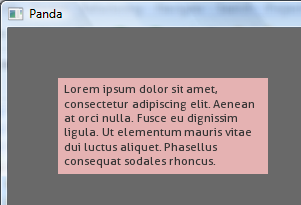
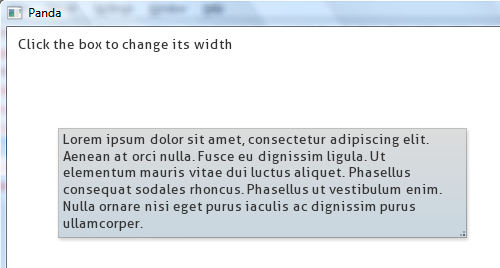
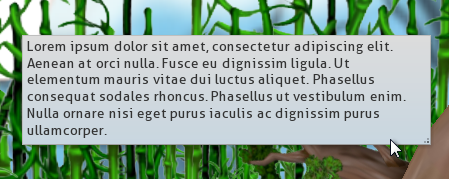
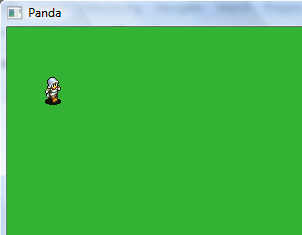
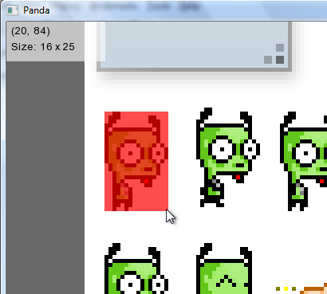

Tools and Tutorials
=================================

Simple Overlays
--------------------------------

The complete source code for this tutorial can be found 
`here <../samples/TestOverlays.py>`_.

First we import overlays and set up a root node for our 2D
elements. We will name the node ``g2d``::

    import overlays
    
    pixel2d = overlays.PixelNode('g2d')
 
Now we can create a red overlay and reparent it to ``pixel2d``::
    
    box1 = overlays.Overlay(color=Vec4(.9, .7, .7, 1))
    box1.reparentTo(pixel2d)
    box1.setZIndex(-1)
    box1.setPos(50, 50)
    
The above is just a simple geometry (a 'card') that is coloured red. We've
also set it's depth to -1, this will come in handy later. We've positioned it
to (50, 50) screen space. Since the overlay has no size, you wouldn't see anything
if you tried running the example now. Let's add some text::

    myFont = overlays.TextOverlay.loadFont('res/Aller_Rg.ttf', size=12) 
    text = overlays.TextOverlay(msg=myMsg, font=myFont, 
                                color=Vec4(0.2,0.2,0.2,1), wordwrap=200)
    text.reparentTo(pixel2d)
    
We use the helper method :func:`TextOverlay.loadFont` to load our Aller font at
size 12. This will load the font with a few options already set, to maximize the
quality of the font.

We then create a text overlay and give it a message and our font. The scale of the
generated text node will be computed automatically. We give the text a dark gray colour
and set its word-wrapping to 200 px. Now, let's resize and reposition these two overlays::

    pad = 5
    x, y = box1.getPos()
    text.setPos(x+pad, y+pad)
    
    w, h = text.getSize()
    box1.setSize(w+pad*2, h+pad*2)
    
We set the location of the text to match the red box, with a slight padding. We 
then set the size of the box, so that the text fits nicely padded inside of it. We
can then finish off with the following code::  
    
    base.accept('aspectRatioChanged', pixel2d.aspectRatioChanged)
    run()

This ensures that the overlays will not look squashed when the aspect ratio changes.

Result:

Advanced Overlays
---------------------------------

The complete source code for this tutorial can be found 
`here <../samples/TestAdvancedOverlays.py>`_. 

This demo is similar to the first, but it adds some functionality
such as:

* Mouse picking at an overlay's 'absolute screen positions'
* Slicing a texture to create a resizable 2D element
* Grouping overlays with OverlayContainer
* Ordering overlays with z-index
* Regenerating text overlays

Try adding some Panda 3D code immediately after the imports to see
how it looks with a scene behind it::

    environ = loader.loadModel("models/environment")
    environ.reparentTo(render)
    environ.setScale(0.25,0.25,0.25)
    environ.setPos(-8,42,0)
    
    def SpinCameraTask(task):
      angledegrees = task.time * 6.0
      angleradians = angledegrees * (math.pi / 180.0)
      base.camera.setPos(20*math.sin(angleradians),-20.0*math.cos(angleradians),3)
      base.camera.setHpr(angledegrees, 0, 0)
      return Task.cont
    
    taskMgr.add(SpinCameraTask, "SpinCameraTask")

Basic 2D Games
---------------------------------

Although the ``overlays`` module is better suited for static GUI/HUD elements,
it can also be used as a base layer for sprite rendering. In the future,
support will be added for more efficient sprite rendering and manipulation. 

``Test2DGame`` demonstrates simple sprite animation. You can find the code
`here <../samples/Test2DGame.py>`_.

Press space to animate the sprite and have him walk across 
the screen. 

``overlaytool``
---------------------------------

The ``overlaytool`` is a simple visualizer for texture slicing with
overlays, and it's also a demonstration of the power and flexibility 
of this module. All of it -- including the pixel pointer/measurer, the help 
window, text elements, and the resizable image itself -- was created using 
overlays. Working with pixels made what would have been a difficult 
project a *very* simple and straight-forward one.

Run it from the command line like so::

    overlaytool.py TEXTURE

Where TEXTURE is the texture to load, such as ``res/img.png``.

.. note::
    This tool was rushed -- it currently only supports Windows
    (using Arial font and win32clipboard). At a later time, a cleaner,
    cross-platform tool will be released.